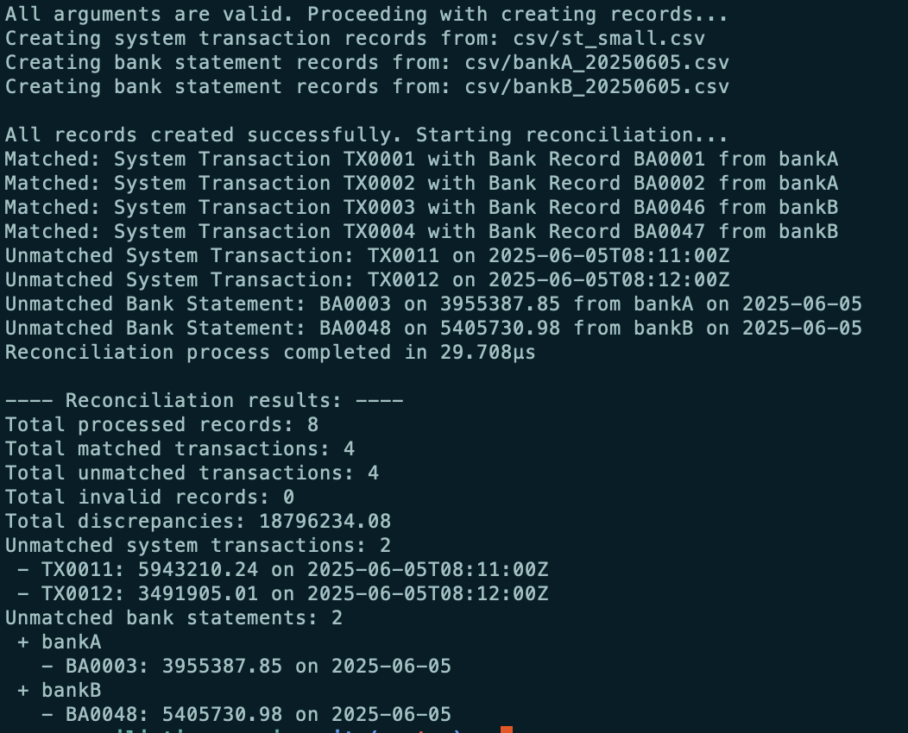

## Problem Statement

Amartha manages multiple bank accounts and requires a service to reconcile transactions occurring within their system against
corresponding transactions reflected in bank statements. This process helps identify errors, discrepancies, and missing transactions.

## Functional Requirements

### Data Model

1. Internal Transactions:

- `trxID` : Unique identifier for the transaction (string)
- `amount` : Transaction amount (decimal)
- `type` : Transaction type (enum: DEBIT, CREDIT)
- `transactionTime` : Date and time of the transaction (datetime)

2. Bank Statement:

- `unique_identifier` : Unique identifier for the transaction in the bank statement (string) (varies by bank, not necessarily equivalent to trxID )
- `amount` : Transaction amount (decimal) (can be negative for debits)
- `date` : Date of the transaction (date)

### Output

1. Total number of transactions processed

2. Total number of matched transactions

3. Total number of unmatched transactions

    3.1. Details of unmatched transactions:

        a. System transaction details if missing in bank statement(s)

        b. Bank statement details if missing in system transactions (grouped by bank)

4. Total discrepancies (sum of absolute differences in amount between matched transactions)

## Non Functional Requirements

1. Date format used in argument is `YYYYMMDD`

2. Allow multiple files for bank statements with format `bankName_YYYYMMDD.csv`

3. Allow processing large dataset (>10000 records)

## Running the program

### You can run the program using following command:

```go run . financial_statement.csv bankName_YYYYMMDD.csv,bankName_YYYYMMDD.csv,... YYYYMMDD YYYYMMDD```

e.g:

```go run . csv/st_small.csv csv/bankA_20250605.csv,csv/bankB_20250605.csv 20250604 20250610```

### Arguments:

1. `Financial statement`: must be in csv

2. `Bank statements`: 
    - must be in csv
    - can be multiple, separated by comma
    - format is bankName_YYYYMMDD.csv (eg: BCA_20250612.csv)

3. `Start date`: format is YYYYMMDD

4. `End date`: format is YYYYMMDD

### Output



## Steps

1. Allow system to receive arguments with following structure: <internal_transaction_file_path> <external_transaction_file_path_1> <external_transaction_file_path_2> ... <external_transaction_file_path_n> <start_date> <end_date>

2. Check availability and validity of each file

3. Store each file to objects based on file structure and add flag as an indicator for matched, validate format for each record as well:
    - Internal Transactions
    - Bank Statements

4. Create object to store discrepancy data

5. Loop through each record in internal transactions and compare with bank statements (using go routine), set flag match if the amount is match

    - Comparison logic:

``` {r, eval = FALSE}
if record amount and date is equal to bank statements 
    then set flag as match and increase matched amount
```

``` {r, eval = FALSE}
if no record is equal to bank statements then 
    set flag as unmatched and
    increase unmatched amount
    add discrepancy data
```

6. Once all of the records in internal transactions have been checked, then check on bank statement for any unmatched flag as it is considered as missing data

7. Print out discrepancies data, invalid data, and processing time


## Test scenarios


### Arguments

1. ```If arguments not have transaction file path then terminate and return error```

2. ```If arguments not have bank statement file path then terminate and return error```

3. ```If arguments not have start date or end date then terminate and return error```

### Files

1. ```If file path and extension is correct then proceed```

2. ```If file path is incorrect then terminate and return error```

3. ```If file extension is not csv then terminate and return error```

### Records

1. ```If first line row is not equal to expected header then terminate and return error```

2. ```if record has incorrect data type then skip and store the error data```

3. ```if record has correct data type then add to object and set its flag to false```

5. ```if record has been stored successfully in object then compare between transaction statements with bank statements```

6. ```if record comparison is matched then set record matched flag to true and increase number of matched transaction```

### Output

1. ```if reaches end of record then count total number of matched transactions```

2. ```if reaches end of record then list of records with record matched flag false and treat as unmatched transactions```

3. ```if reaches end of record then count total number of unmatched transactions```

4. ```if reaches end of record then sum total discrepancies```